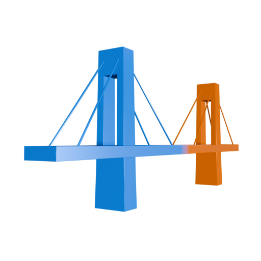
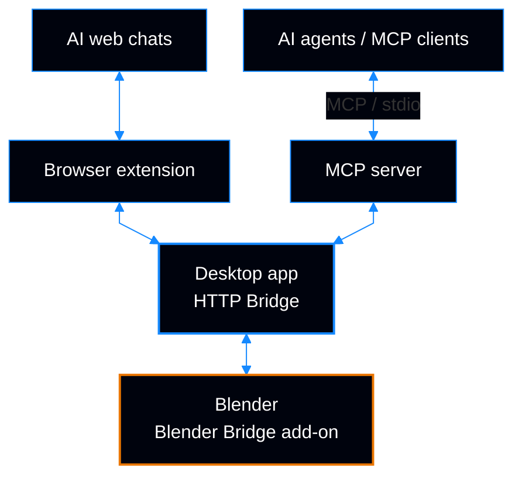
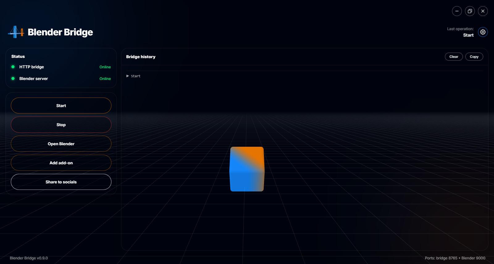
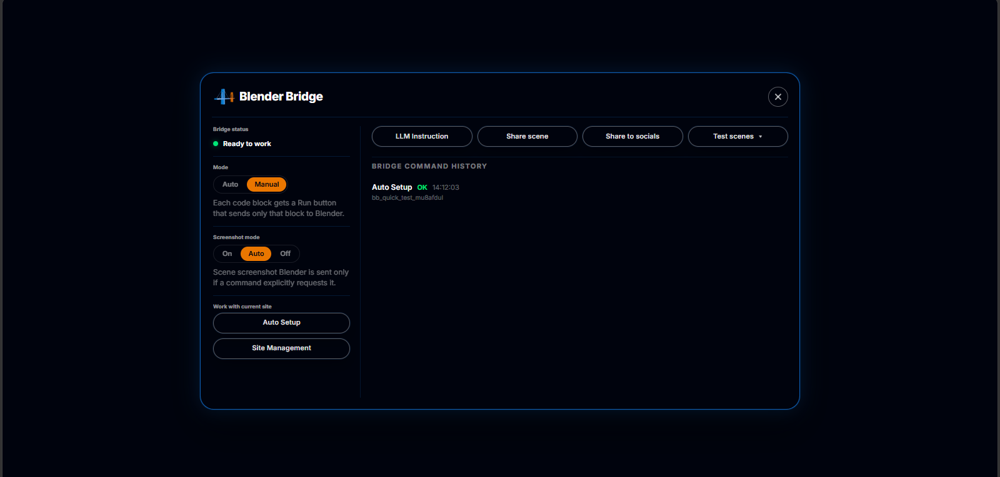
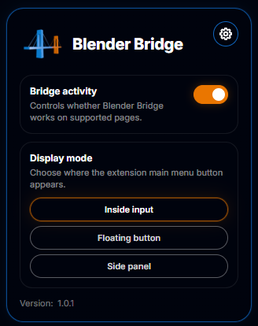

# Blender Bridge

**Connect any AI assistant, agent environment, or autonomous coding assistant directly to your live Blender scene.**

Real-time bidirectional bridge: AI writes native Blender Python → executes in your active viewport → receives visual screenshot feedback → iterates autonomously.

 

[**Official Website**](https://blenderbridge.com) &nbsp;•&nbsp;
[**Download**](https://blenderbridge.com/#download) &nbsp;•&nbsp;
[**Chrome Extension**](https://chromewebstore.google.com/detail/blender-bridge/lgdjpajmggpkjcdogglbeipbkckdpoki) &nbsp;•&nbsp;
[**Support**](mailto:support@blenderbridge.com)

 

---

## What is Blender Bridge?

Blender Bridge establishes a persistent, high-speed connection between any artificial intelligence and your active Blender workspace.

Blender Bridge connects your AI to your active 3D workflow:

- **Native Python Execution:** The AI works directly through Blender's official Python API (`bpy`). It constructs parametric geometry, procedural shader networks, lighting rigs, modifier stacks, physics simulations, and keyframe animations directly in your `.blend` file.
- **Closed Visual Feedback Loop:** After executing changes, Blender Bridge captures high-resolution viewport screenshots and returns them directly to the AI. Your model can inspect the scene, identify errors, refine materials, adjust composition, and iterate toward your intended result.
- **Native Scene Undo:** Revert the last supported scene operation through Blender’s native undo history.

---

## Architecture & The Bidirectional Loop

Web chats connect through the browser extension. AI agents connect through the MCP server. Both use the bridge managed by the desktop app to work with your active Blender scene.

Commands travel to Blender; execution results, scene data, and screenshots return through the same connection.

### The Desktop Companion App
The local companion app manages bridge lifecycle, loopback communication with Blender, active connection health, and one-click add-on installation:

 

 
Real-time connection monitoring, one-click add-on management, and bridge activity history.

---

## The Role of Your AI Model

Blender Bridge provides the high-speed execution bridge and visual feedback loop, but the spatial complexity, procedural depth, and visual polish of the resulting 3D scene depend directly on the reasoning capabilities of the AI model you connect:

- **Advanced Multimodal & Reasoning Models:** Excel at complex 3D mathematics, procedural shader graphs, physical lighting setups, multi-camera cinematography, and diagnosing visual defects through viewport screenshots.
- **Compact & Local Models:** Ideal for rapid prototyping, primitive manipulation, basic asset placement, and straightforward Python tasks.

> [!NOTE]
> Blender Bridge is model-agnostic: choose the AI model that fits your task and use its capabilities to inspect and refine your Blender scene.

---

## Universal Connectivity: Two Ways to Work

Blender Bridge is designed to be completely universal. It does not tie you to a single AI provider, chat interface, or development environment:

### 1. Universal Browser Extension
*For interactive workflows in any Chromium browser.*

 

 
In-page control panel: execution modes, viewport capture toggles, scene operations, and activity history.
  

 
Quick settings popup: global bridge toggle and display mode selection.
 

- **Connect Your Web AI Interface:** Use Auto Setup with ChatGPT, Claude, Google Gemini, DeepSeek, HuggingChat, local WebUIs, self-hosted LLM frontends, corporate chats, and others.
- **Universal Auto Setup:** A dynamic site-mapping system. Because web interfaces vary, Auto Setup analyzes the structure of the selected chat page (input prompt field, send trigger, message container). Once configured, the extension uses that mapping to send commands and return results in the chat.
- **Three UI Display Modes:** Choose how the extension integrates into your browser:
  1. *Embedded In-Chat Icon:* Sits neatly within the chat's input or message toolbar.
  2. *Floating Action Button:* A moveable button that toggles the primary control panel on demand.
  3. *Side Panel Mode:* Runs in Chrome's dedicated browser side panel alongside your conversation.
- **Controlled Execution Modes:**
  - *Manual Mode (Default):* Whenever the AI produces Blender code, an interactive **Run** button appears. You inspect the code and execute it with a single click.
  - *Auto Mode:* Can be toggled on to execute incoming Blender commands automatically for continuous hands-off generation.
- **Visual Feedback & Scene Controls:** Configure viewport capture delivery (on-demand or automatic), run Scene Scans to inspect object hierarchies, and trigger single-click Undo.
- **Multilingual Support:** The extension interface is fully localized in **15 languages**.

### 2. Universal MCP Server (Model Context Protocol)
*For autonomous agents, coding assistants, and agent environments.*

- **Broad Client Compatibility:** Operates over standard `stdio` with any tool supporting the open Model Context Protocol, including Cursor, Claude Code, Codex, Antigravity, Windsurf, VS Code (with Cline / Roo Code), and custom CLI agents.
- **Zero Configuration Friction:** Pre-packaged with an isolated, bundled Node runtime. You do not need to install `npm`, configure system environment variables, or manage dependencies.
- **Autonomous Multi-Step Iteration:** Agents can query scene hierarchies, generate geometry, request viewport renders, inspect visual quality, and refine the 3D scene across multiple autonomous steps with the execution controls of their MCP client.
- **Specialized Blender Tools:** Work with your Blender scene through dedicated tools:
  - Executing Python scripts in the active scene.
  - Querying detailed scene state, object lists, materials, and modifier properties.
  - Capturing viewport screenshots from active angles or specific cameras.
  - Reverting actions cleanly via the native Blender undo history.
  - Running diagnostic test scenes to verify system readiness.
- **One-Click Agent Setup:** Open the Blender Bridge Desktop app, go to the **MCP** tab, and click **Copy instruction for agent**. Paste that instruction into your agent's chat, or follow it when configuring your MCP client — the app automatically supplies the exact, verified paths for your installation.

---

## Quick Start

### 1. Install Blender Bridge Desktop
Download and install the companion application from [blenderbridge.com/#download](https://blenderbridge.com/#download).

### 2. Enable the Blender Add-on
1. Open the Blender Bridge desktop application and sign in. You can activate a **7-day free trial**, with no card required.
2. Click **Add add-on** and follow the setup prompts to install and connect the Blender add-on.
3. Open Blender, click **Start** in the desktop app, and verify that **HTTP bridge** and **Blender server** both show **Online**.

### 3. Connect Your AI

#### Option A: Browser Extension (Web Chats)
1. Install the **[Blender Bridge Extension](https://chromewebstore.google.com/detail/blender-bridge/lgdjpajmggpkjcdogglbeipbkckdpoki)** from the Chrome Web Store.
2. Open the extension and sign in. Copy the **Pairing key** from the desktop app’s settings into the extension’s **Settings → Pairing key**. Keep the desktop bridge running.
3. Open your preferred AI chat, run **Auto Setup**, and choose an embedded button, floating button, or side panel.
4. Use **LLM Instruction** in the extension menu to give your AI the Blender Bridge instructions.
5. Describe your scene and click **Run** when the AI generates a Blender command.

#### Option B: MCP Server (Agents & Environments)
1. In the Blender Bridge desktop application, open the **MCP** tab.
2. Click **Copy instruction for agent**.
3. Paste the instruction into your agent’s chat, or follow its steps in your MCP client’s configuration (e.g. Cursor, Claude Desktop, Windsurf).
4. Prompt your agent to inspect or build scenes in Blender.

---

## Full Blender Capability Surface

Blender Bridge executes directly against Blender's full official Python API (`bpy`). There are no artificial sandbox restrictions or locked features. The AI has access to the full scope of Blender's engine:

| Creative Domain | What the AI Can Control |
| :--- | :--- |
| **Geometry & Modeling** | Primitives, procedural mesh generation, Boolean operations, modifier stacks, subdivision surfaces, curves, sculpting automation, and complex Geometry Nodes node graphs. |
| **Shading & Materials** | Principled BSDF networks, procedural noise and Voronoi textures, glass, subsurface scattering (SSS), emission, UV mapping, and material slot assignments. |
| **Lighting & Environment** | Three-point studio lighting, Sun, Area, Spot, and Point lamps, HDRI world environments, color temperature, volumetric fog, and atmospheric scattering. |
| **Cameras & Cinematography** | Sensor sizes, focal lengths, depth of field (DoF), autofocus targets, composition guides, object tracking, and multi-camera rigs. |
| **Animation & Rigging** | Keyframing, graph editor curves, shape keys, armatures, constraints, path followers, driver expressions, and physics baking. |
| **Physics & Simulations** | Rigid body dynamics, cloth simulations, fluid/smoke domains, soft bodies, collision boundaries, and force fields. |
| **Rendering & Compositing** | Cycles and EEVEE-Next engine configurations, sample counts, denoising, render passes (AO, Mist, Cryptomatte), compositing trees, and automated file output. |

---

## Execution & Scene Undo

- **Isolated Network Boundary:** The communication socket binds strictly to `127.0.0.1`. It does not listen on external network adapters and cannot be discovered or accessed by other devices on your local network.
- **Cryptographic Execution Leases:** Code execution requires an active, short-lived authorization lease signed by the official auth gateway. Commands require the pairing key and a valid signed access grant.
- **Native Scene Undo:** Undo the last supported scene operation through the extension or MCP. External Python effects, such as files written to disk, are not reverted.
- **Zero Creative Telemetry:** We collect zero telemetry on your models, meshes, textures, prompts, or generated scenes. The extension contains no advertising or analytics SDK and never sells user data.

---

## System Requirements

| Parameter | Requirement |
| :--- | :--- |
| **Operating System** | Windows 10 or Windows 11 (64-bit) |
| **Blender Version** | Blender 4.0+, 4.2 LTS, 4.3+, and 5.x |
| **Browser (Extension)** | Google Chrome, Microsoft Edge, Brave, Opera, or any modern Chromium browser |
| **MCP Hosts (Agent)** | Cursor, Claude Code, Claude Desktop, Codex, Antigravity, Windsurf, VS Code, or any stdio MCP host |
| **AI Access** | Your preferred AI model or subscription (OpenAI, Anthropic, Google, DeepSeek, or local LLMs) |

---

## Pricing & Licensing

Activate a one-time, **7-day free trial** with full access to the desktop companion app, the browser extension, and the MCP server. No credit card required.

After the trial, Blender Bridge is available via flexible subscription plans:
- **1 Month**
- **3 Months**
- **6 Months**
- **12 Months**

View current pricing and available options on [blenderbridge.com/#pricing](https://blenderbridge.com/#pricing).

---

## Automatic Updates

The Blender Bridge ecosystem is designed to stay synchronized:
- **Desktop Application & MCP Server:** Checks for updates on launch via cryptographically signed releases and patches smoothly.
- **Blender Add-on:** Updated directly through the desktop application.
- **Browser Extension:** Updates automatically through the Chrome Web Store.

---

## Troubleshooting & FAQ

<b>"Blender not connected" in the desktop app</b>

1. Make sure Blender is actively running. Blender Bridge connects to an open scene, not a closed program.
2. In Blender's 3D Viewport, press <kbd>N</kbd> to open the sidebar and navigate to the **Blender Bridge** tab. Confirm the server status is **Running** on `127.0.0.1:9000`.
3. If the server is stopped, click **Start Server**.
4. If port `9000` is in use by another program, change the port in the add-on preferences and update it in the desktop app settings.

<b>Extension panel does not appear on a chat page</b>

1. Reload the chat webpage once after installing the extension (browser security rules prevent extensions from injecting into tabs opened prior to installation).
2. Ensure you have completed **Universal Auto Setup** on that chat site so the extension can recognize the page layout.
3. Check that the Blender Bridge desktop application is running on your machine.

<b>MCP Agent fails to start or locate the server</b>

1. Do not hand-type installation paths. Open the Blender Bridge desktop app, navigate to the **MCP** tab, and click **Copy instruction for agent**.
2. Paste the exact copied configuration into your client's settings.
3. Completely restart your MCP client (Cursor, Claude Desktop, VS Code) to reload the configuration.

---

## Support

If you have questions, feedback, or need technical assistance, contact our team directly at [support@blenderbridge.com](mailto:support@blenderbridge.com).

---

## Trademark Disclaimer

Blender Bridge is an independent commercial software product developed by Danil Anufriev. It is not affiliated with, endorsed by, or sponsored by the Blender Foundation. "Blender" is a registered trademark of the Blender Foundation in the EU, the USA, and other territories.

 
© 2026 Blender Bridge. All rights reserved.

